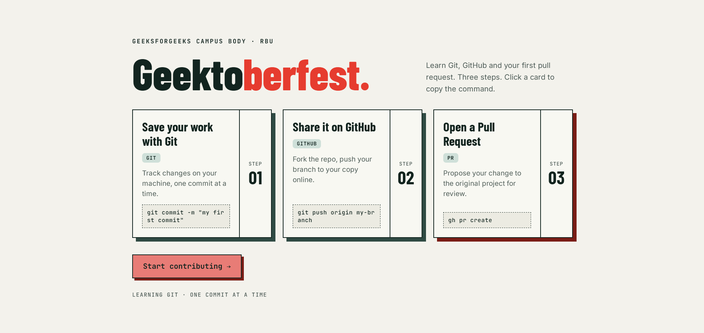

# Geektoberfest

A minimal single-page site for **Geektoberfest**, by the GeeksforGeeks Campus Body at RBU. It teaches three things: **Git**, **GitHub** and your first **Pull Request**.

## Tech stack

  
  
  

One HTML file with inline CSS and JS. There is no build step and no dependencies.

## Run it

Open `index.html` in your browser.

## Contribute

Contributions are welcome, and this repo is a good place to make your first pull request. Read [CONTRIBUTING.md](CONTRIBUTING.md) to get started.

## License

MIT
